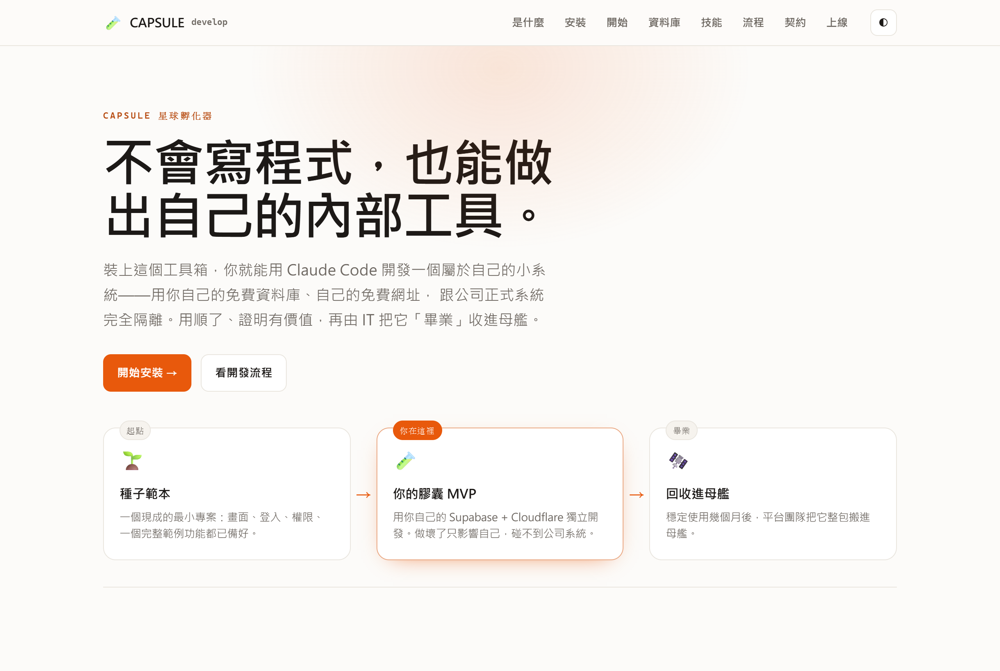
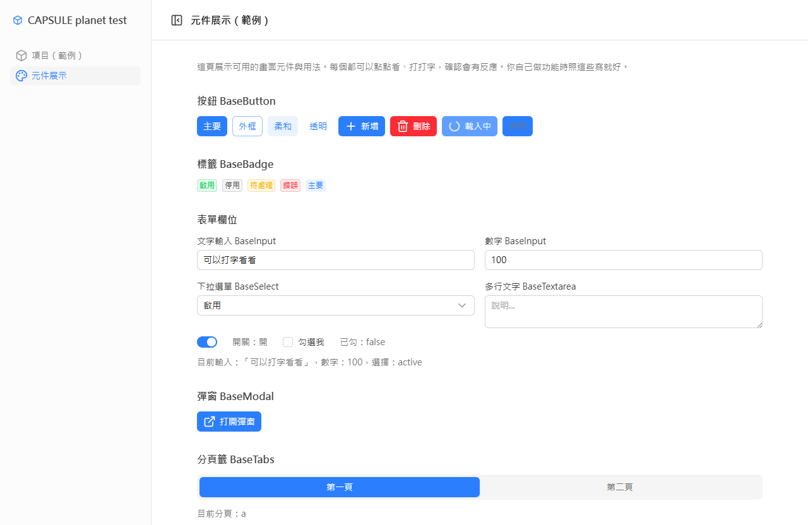

# capsule-develop — CAPSULE 星球孵化器工具箱

給公司同事（包含非工程師）用 Claude Code 開發**獨立的內部工具 MVP**的一組技能。每個 MVP 用自己的 Supabase + 免費 Cloudflare Pages 部署，跟公司正式系統完全隔離；成熟後由平台團隊「畢業回收」進母艦。

## 線上看看
- 📖 **視覺化上手指引（GitHub Pages）** → <https://capsule-taiwan.github.io/capsule-develop/>
- 🧪 **範例 MVP demo（實際部署在 Cloudflare Pages）** → <https://capsule-planet-test.pages.dev/>　（內部畫面需公司 Google 登入；未登入只看得到登入頁）

[](https://capsule-taiwan.github.io/capsule-develop/)

<sub>▲ 點圖進入線上指引頁</sub>

範例 MVP 內建的儀表板版型與元件庫——你做功能時照這些現成元件組，不會長歪：



## 這是什麼

安裝這個 plugin 後，你在 Claude Code 會多出這些技能：

| 技能 | 做什麼 |
|---|---|
| `/doctor` | 檢查並自動裝好 Node.js 與 git（新電腦第一次先跑這個） |
| `/new-project` | 一鍵長出一個新專案骨架（Nuxt + Supabase + 內建 UI/權限/範例模組），自帶回收契約 |
| `/task-brief` | 用業務語言訪談你的需求，寫成規格文件 |
| `/new-feature` | 照著範例模組（items）長出你要的新功能（列表/表單/權限/測試一整套） |
| `/next-migration` | 幫你取號、產生資料庫變更檔的骨架 |
| `/check` | 跑測試 + 型別檢查 + 契約檢查，全綠才算完成 |
| `/deploy` | 部署到你自己的 Cloudflare Pages（免費） |
| `/graduate` | 產生「畢業申請包」，交給平台團隊審查是否收進母艦 |

安裝後還會自動載入護欄（hooks），擋掉危險操作與「改到平台共用檔」。

## 開始前你需要（Step 0）
- **Claude Code** 裝好並用**付費方案**（Pro / Max，或 API 計費）登入——這整套工具是在 Claude Code 裡跑的。還沒有的話先到 Anthropic 官方裝好、登入，再回來。
- **Windows 或 macOS**。Node.js 與 git **不用**先裝——第一次在新電腦，先在 Claude Code 裡打 `/doctor`，它會用 winget/brew 幫你把 Node 與 git 裝好（可能跳出系統權限視窗，按允許；公司電腦若被擋就找 IT）。
- 裝不起來或不確定 → 找 IT。

## 安裝

### 方式一：個人安裝（在 Claude Code 裡打指令）
```
/plugin marketplace add capsule-taiwan/capsule-develop
/plugin install capsule-develop@capsule-tools
```

### 方式二：團隊自動啟用（IT 在共用 repo 的 `.claude/settings.json` 加這段，成員 clone 後自動生效）
```json
{
  "extraKnownMarketplaces": {
    "capsule-tools": {
      "source": { "source": "github", "repo": "capsule-taiwan/capsule-develop" }
    }
  },
  "enabledPlugins": {
    "capsule-develop@capsule-tools": true
  }
}
```

## 開始用

裝好後，在一個空資料夾開 Claude Code，輸入：
```
/new-project
```
它會問你專案名稱、模組代號，然後長出骨架、引導你建立自己的免費 Supabase 專案、起本地開發伺服器。之後就用 `/task-brief` → `/new-feature` 迭代開發，`/check` 通過就 `/deploy`。

> 登入採**公司 Google 帳號**（限 @capsulecorporation.cc）。跑完 `/new-project` 你會看到登入頁但一開始還登不進去——把你的 Supabase 網址給工程師（IT）跑 `/enable-login` 開通後即可登入，**第一個登入的人是管理員**。這是刻意的人工把關。

## 孵化器模型（為什麼這樣設計）

```
範本 → 你的獨立 MVP（自己的 Supabase + Cloudflare）→ 用幾個月證明可行 → 平台團隊回收進母艦
```

你在自己的沙盒裡開發，碰不到公司正式機/測試機，做壞了也只影響自己的 MVP。但範本強制的慣例（表前綴、共用 UI 元件、資料層寫法、內建權限）讓你的成果**天生長成可以裝回大系統的形狀**——回收時平台團隊只要重放資料庫變更檔、把你的功能目錄整包搬進去即可。


## 給平台團隊（維護者）

- 範本本體在 `plugins/capsule-develop/template/`，改這裡等於改所有未來 MVP 的起點。
- 技能在 `plugins/capsule-develop/skills/`，護欄在 `plugins/capsule-develop/hooks/`。
- 本 repo 同時是 marketplace（`.claude-plugin/marketplace.json`）也是 plugin 來源。
- 驗證：`claude plugin validate .`
